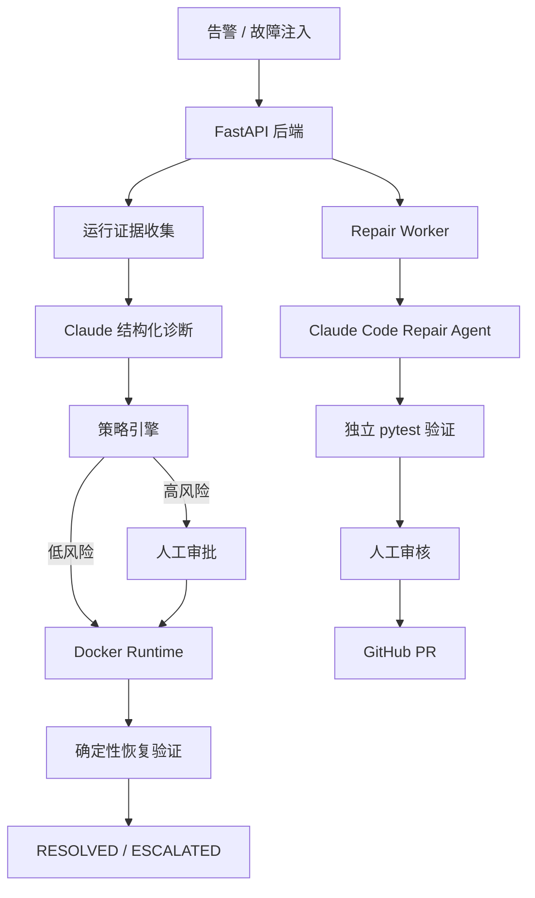

# OpsGuard｜智能故障诊断与安全修复平台

这是一个事件驱动的 AI 后端系统，用于完成：

- Claude 故障诊断
- Docker 服务重启与版本回滚
- 高风险操作人工审批
- 修复后的确定性验证
- 隔离式代码修复
- 人工批准后发布 GitHub Pull Request

项目核心是将大模型的推理能力接入一个**有状态、可审计、受权限约束**的后端系统，而不是让模型直接执行 Shell 或 Docker 命令。

## 系统架构



## 核心工作流

### 运行时故障修复

```text
接收告警
→ 收集服务、容器、部署和指标证据
→ Claude 输出结构化诊断
→ 服务端检查动作和参数
→ 自动执行低风险操作，或等待人工审批
→ Docker 执行重启或回滚
→ 验证服务是否真正恢复
```

支持的演示场景：

| 场景 | 修复动作 | 审批 |
|---|---|---|
| 服务不可用 | `restart_service` | 不需要 |
| 稳定版本高延迟 | `restart_service` | 不需要 |
| 部署回归 | `rollback_deployment` | 必须 |

### 代码修复

```text
创建 Repair Job
→ 复制白名单源码到隔离工作区
→ 确认基线测试失败
→ Claude 生成最小补丁
→ 检查测试和受保护文件未被修改
→ 独立运行 pytest
→ PATCH_READY
→ 人工审批
→ 可选发布 GitHub PR
```

## 安全设计

- 故障诊断 Agent 没有 Shell、文件系统或 Docker 工具。
- 模型只能选择白名单动作，不能生成任意执行命令。
- 后端会重新构造可信参数，不直接执行模型返回的容器参数。
- 服务重启属于低风险操作，可自动执行。
- 版本回滚属于高风险操作，必须人工审批。
- Repair Worker 不持有 Docker Socket 或 GitHub Token。
- 代码补丁必须经过独立测试和人工审核。
- 系统不会自动合并 Pull Request。
- 所有状态变化、诊断、审批、执行和验证结果都会写入审计事件。

## 技术栈

- Python 3.12
- FastAPI
- SQLAlchemy + SQLite
- Claude Agent SDK
- Docker SDK + Docker Compose
- Pydantic
- httpx
- pytest
- GitHub Actions

## 快速启动

### 1. 配置环境变量

```bash
cp .env.example .env
```

使用 Claude 时配置：

```env
AI_PROVIDER=claude
AI_FALLBACK_TO_RULES=false
ANTHROPIC_API_KEY=你的_API_Key

REPAIR_AGENT_PROVIDER=claude
REPAIR_CLAUDE_MAX_TURNS=20
```

### 2. 启动服务

```bash
docker compose up -d --build
```

服务地址：

| 服务 | 地址 |
|---|---|
| 后端 API | `http://localhost:8001` |
| Swagger | `http://localhost:8001/docs` |
| 演示服务 | `http://localhost:8081` |

## 运行演示

### 服务不可用

```bash
docker compose exec -T backend \
  python scripts/run_demo.py service_unavailable \
  --base-url http://127.0.0.1:8000
```

### 部署回归

```bash
docker compose exec -T backend \
  python scripts/run_demo.py deploy_regression \
  --approve \
  --base-url http://127.0.0.1:8000
```

### 高延迟

```bash
docker compose exec -T backend \
  python scripts/run_demo.py high_latency \
  --base-url http://127.0.0.1:8000
```

### 代码修复

```bash
docker compose exec -T backend \
  python scripts/run_repair_demo.py \
  --base-url http://127.0.0.1:8000
```

代码修复 Agent 会修复 `RecentRequestBuffer` 无容量限制的问题，并且只允许修改：

```text
sample_service/cache.py
```

## 最小端到端评测

评测规模：

```text
service_unavailable × 3
deploy_regression × 3
high_latency × 3
code_repair × 2
```

最终结果：

| 指标 | 结果 |
|---|---:|
| 运行时完整成功率 | 9/9，100% |
| 修复动作准确率 | 9/9，100% |
| 审批流程正确率 | 9/9，100% |
| 修复后验证通过率 | 9/9，100% |
| 代码修复成功率 | 2/2，100% |
| 修改范围合规率 | 2/2，100% |
| 平均 Incident 处理时间 | 20.88 秒 |
| 平均代码修复时间 | 53.45 秒 |

运行评测：

```bash
python evaluation/run_minimal_evaluation.py \
  --base-url http://127.0.0.1:8001
```

完整结果：

- [`evaluation/results/final_summary.md`](evaluation/results/final_summary.md)
- [`evaluation/results/final_results.csv`](evaluation/results/final_results.csv)

> 该评测用于验证项目流程和可复现性，样本量较小，不代表生产环境性能。

## 自动化测试

```bash
AI_PROVIDER=rules \
RUNTIME_BACKEND=memory \
REPAIR_AGENT_PROVIDER=rules \
GITHUB_PR_ENABLED=false \
pytest -q
```

当前结果：

```text
12 passed
```

GitHub Actions 会在提交和 Pull Request 时自动运行语法检查和测试，不调用 Claude API。

## GitHub PR

经过测试并人工批准的补丁，可以由后端发布到独立演示仓库：

[incident-repair-demo](https://github.com/posthoctao/incident-repair-demo)

Repair Worker 和 Claude 无法接触 GitHub Token，也不会自动合并 PR。
